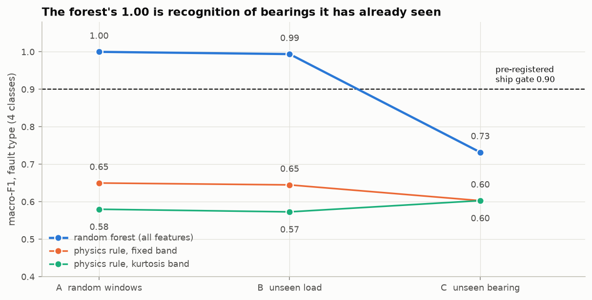
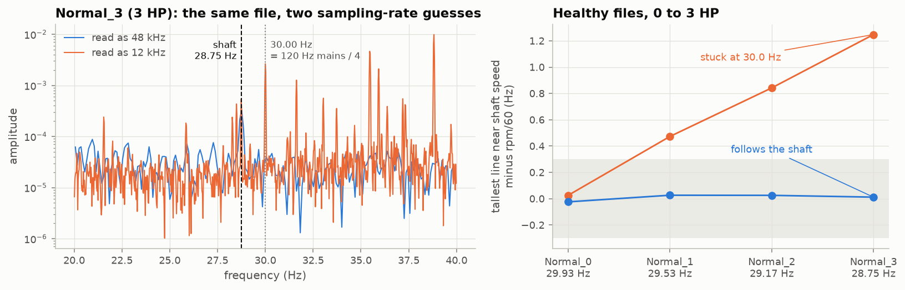
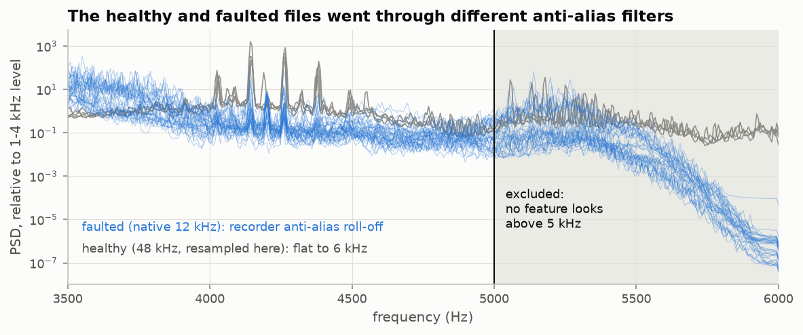
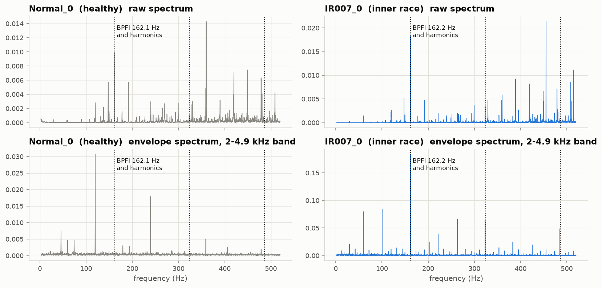
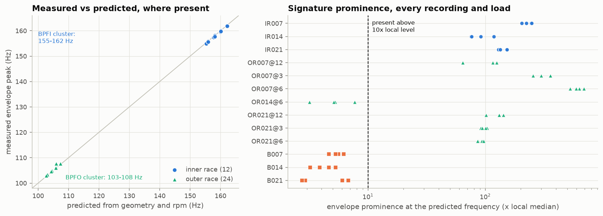
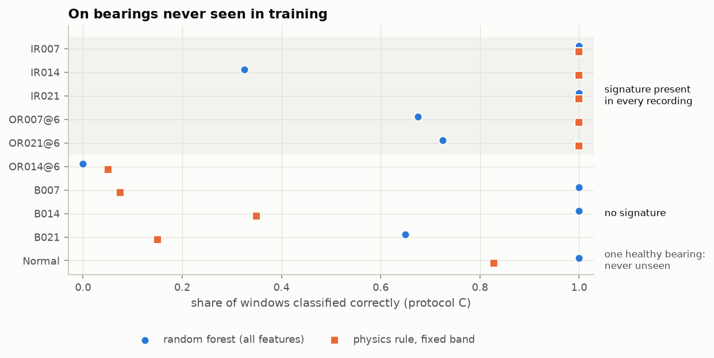
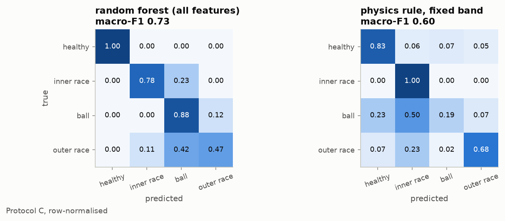
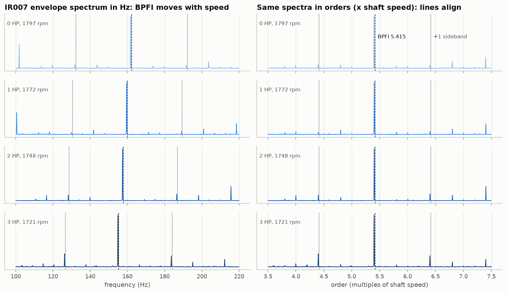
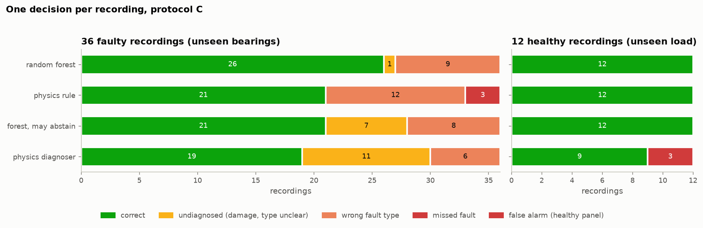

# bearing-audit

[](https://github.com/parvparakhiya/bearing-audit/actions/workflows/ci.yml)

Bearing fault diagnosis on the CWRU vibration dataset, evaluated per physical
bearing. The envelope analysis is written from scratch on top of
`numpy`/`scipy`, every fault frequency is checked against the bearing's
kinematics, and the classification results are audited for leakage.

In short: a random forest gets a macro-F1 of 1.00 when the windows are split
at random, which is how most published CWRU results are produced. On bearings
it has never seen, it gets 0.73 (0.64–0.74 across ten random seeds). A physics
rule with one learned parameter gets 0.60. The ship gate of 0.90 was fixed
before the first audit run, and neither of them reaches it, so nothing ships.

The per-bearing breakdown says more than the headline. On the five bearings
where the kinematic fault signature is physically present, the physics rule
gets every window right on bearings it has never seen, and the forest doesn't.
On the four bearings where the signature is missing (every ball fault, plus
OR014), none of the methods here can be trusted. The forest's ball-fault
accuracy looks good only because it uses "ball" as a catch-all label.

There are two notebooks, both committed with their outputs:

- [`notebooks/bearing_audit_presentation.ipynb`](notebooks/bearing_audit_presentation.ipynb)
  is a ten-minute tour: the data traps, envelope analysis run live on a
  recording, the leakage audit, the plant-level evaluation, and the API on
  real data.
- [`notebooks/bearing_audit_full_pipeline.ipynb`](notebooks/bearing_audit_full_pipeline.ipynb)
  goes through the whole project step by step, starting from the raw `.mat`
  files. Every algorithm is written out in the cells, and 31 checks confirm it
  gives the same answers as the package and the committed results.



A second stage judges the systems the way a plant would: one decision per
measurement, false alarms first, and an explicit "damage detected, type
unclear" answer. It has its own gate, also written down in advance. On this
data detection is solved: both forests catch all 36 faulty recordings with
0 false alarms out of 12. Diagnosis on unseen bearings is not. The best system
names the right component 74 % of the time, and a technician needs 95 %, so
nothing ships here either. The details are in
[the industrial evaluation section](#industrial-evaluation-judged-the-way-a-plant-judges-it).

The idea is the same as in [`pdm-audit`](https://github.com/parvparakhiya/pdm-audit),
applied to waveforms instead of tables: the impressive number was measuring the
evaluation setup rather than the model.

---

## Findings

Recording names follow CWRU's scheme: fault type (IR inner race, B ball, OR
outer race), fault size in thousandths of an inch, the clock position of an
outer-race fault, then the motor load in HP. So `OR007@12_1` is an outer-race
fault 0.007" across, at 12 o'clock, recorded at 1 HP, and `Normal_0` is the
healthy bearing at 0 HP.

### 1. The healthy recordings are 48 kHz, and physics proves it

A `.mat` file doesn't store its sampling rate. The four healthy baselines were
recorded at 48 kHz and the fault files at 12 kHz. Reading a 48 kHz file as
12 kHz divides every frequency by 4, and the plot still looks plausible.

The test is that a shaft line has to sit at rpm/60 and move with it:

| | read as 12 kHz | read as 48 kHz |
|---|---|---|
| healthy files: tallest line within ±10 % of rpm/60 is within 0.3 Hz of it | 1 / 4 | **4 / 4** |
| fault files: same test | **51 / 52** | 4 / 52 |
| healthy files: duration | 20.3–40.5 s | **5.1–10.1 s** |
| fault files: duration | **10.1–10.2 s** | 2.5–2.6 s |

The one healthy file that "passes" at 12 kHz is a trap. Read at 12 kHz,
Normal_0 (0 HP) shows a line at 29.96 Hz, just 0.03 Hz from its 29.93 Hz shaft
speed. At the true 48 kHz scale that line is at 119.8 Hz, where the 120 Hz
electrical line and the 4th shaft harmonic overlap (a 5 s record can't
separate them). As the load goes up, the shaft slows to 28.75 Hz, but the
misread electrical line stays at 30.00 Hz (fig. 1, right). The file durations
give an independent check.



The same test confirms the catalogue speeds for the two healthy files that
don't store an rpm (Normal_1, Normal_2): their shaft line is within 0.03 Hz of
the catalogue value.

### 2. The healthy and faulted files went through different anti-alias filters

The 12 kHz fault files roll off steeply from about 5.2 kHz, because of the
recorder's anti-alias filter. The healthy files, resampled from 48 kHz by the
loader, stay flat up to 6 kHz. Relative to their 1–4 kHz level, the healthy
files have about 0.09 of energy at 5.6–6 kHz, against 2.5·10⁻⁵ to 1.9·10⁻⁴ for
the fault classes.

So a single feature, the energy above 5.5 kHz in the raw signal, separates
healthy from faulted windows with 100 % balanced accuracy in every fold of
leave-one-load-out cross-validation. It is measuring the recorder, not the
bearing.

A low-pass filter doesn't remove that information, it only scales it down.
That's why every feature is computed on signals low-passed at 5 kHz
(8th-order Butterworth, zero-phase), and the spectral bands stop at 5 kHz.
The measured amplitude gain is 0.50 at 5.0 kHz, 0.024 at 5.2 kHz and 2·10⁻⁴
at 5.4 kHz. Two checks back this up:

- A regression test adds a 5.3 kHz or 5.6 kHz tone, louder than the whole
  bearing signal, and none of the 22 features changes by more than 1 % (or
  0.005 absolute).
- A post-hoc run with a stricter 4.7 kHz cutoff moves the protocol-C scores by
  at most 0.015 (forest 0.736 vs 0.732, fixed-band rule 0.600 vs 0.603).



### 3. Three data-quality traps in the files themselves

- `Normal_2.mat` (record 99) also contains a byte-identical copy of record 98,
  which is the whole of `Normal_1.mat`, and that copy comes first. A loader
  that takes "the first DE channel" quietly loads Normal_1 twice. This one
  selects channels by record number.
- `OR007@12_1` stores 1773 rpm, but its own BPFO line implies about 1797 rpm.
  The other 23 outer-race recordings with a BPFO line show it at 3.59–3.60×
  their stored shaft speed, while this one shows 3.65×. It's a physics-only
  file, so no classification result depends on it.
- The 0.028" files are a different bearing. CWRU used NTN bearings for that
  size, not the SKF 6205 that the fault frequencies are computed for. These
  files also store no rpm, and their internal record numbers don't match the
  catalogue, so they're excluded ([`data/PROVENANCE.md`](data/PROVENANCE.md)).

### 4. The physics works where the fault signature exists

For every faulted recording, the envelope spectrum is searched within ±3 % of
the fault frequency predicted from the geometry and that recording's own rpm:

| fault | recordings | signature present (≥ 10× local level) | median prominence | median frequency error |
|---|---|---|---|---|
| inner race (BPFI) | 12 | **12** | 144× | 0.22 % |
| outer race (BPFO) | 28 | **24** | 102× | 0.30 % |
| ball (2×BSF) | 12 | **0** | 5× | — |

The measured peaks sit at 5.40–5.41× shaft speed for BPFI (predicted 5.415×)
and at 3.59–3.60× for BPFO (predicted 3.585×), at every load. The peak moves
with the shaft, and that's the part that could have failed.

The four outer-race recordings without a line are all OR014@6. The ball-fault
envelopes have no consistent line at all: their tallest line between 50 and
400 Hz falls at a different multiple of shaft speed in almost every recording.
That matches
[Smith & Randall (2015)](https://www.researchgate.net/publication/276248554_Rolling_Element_Bearing_Diagnostics_Using_the_Case_Western_Reserve_University_Data_A_Benchmark_Study),
who found that relatively few CWRU records show the classical signature of
their fault type.




A fixed 2–4.9 kHz demodulation band gives higher prominence than the
spectral-kurtosis band on 35 of 52 recordings (medians 144× vs 94× for inner
race, 102× vs 69× for outer race). So the fixed band is the main one, and both
are reported.

### 5. The leakage audit

The data is 40 recordings of 10 physical bearings, 1 healthy and 9 faulted.
Each bearing was recorded at 4 motor loads, and the recordings are cut into
1 s windows, 395 in total. Three split protocols each keep a larger unit apart:

| protocol | what is kept apart | forest | physics rule (fixed band) | physics rule (SK band) |
|---|---|---|---|---|
| **A** random windows, 5-fold | nothing: windows of one recording on both sides | **1.000** | 0.650 | 0.580 |
| **B** leave one load out, 4-fold | recordings, but every bearing is seen at another load | 0.994 | 0.645 | 0.573 |
| **C** unseen bearing and unseen load, 12-fold | the physical bearing | **0.732** ± 0.22 | 0.603 ± 0.10 | 0.603 ± 0.11 |

Scores are mean macro-F1 over the folds, for 4 classes (healthy, inner race,
ball, outer race). The 10-class task (type and size) scores 0.997 under A and
0.974 under B. It can't be run under C, because the held-out size never
appears in training.

From A to C the forest loses 27 points and the fixed-band rule loses 5. The
kurtosis-band rule doesn't lose anything (+2). The rules have almost nothing
to memorise: the kinematics plus one threshold, learned per fold (2.3×–3.4×
prominence).

The ship gate was fixed before the first audit run: on protocol C, mean
macro-F1 ≥ 0.90 and every class recall ≥ 0.80.

| candidate | macro-F1 | worst class recall | ship |
|---|---|---|---|
| forest (seed 0) | 0.732 | outer race 0.47 | no |
| physics rule, fixed band | 0.603 | ball 0.19 | no |
| physics rule, SK band | 0.603 | ball 0.20 | no |

How much of the forest's score is noise? Across ten seeds (post-hoc), its
protocol-C macro-F1 ranges from 0.641 to 0.737, with a mean of 0.702. With
scikit-learn 1.8.0 instead of the pinned 1.9.1, seed 0 gives 0.715. None of
this changes the verdict.

### 6. Why the forest fails on new bearings



Per-bearing accuracy under protocol C lines up with finding 4:

- Where the signature is present (IR007, IR014, IR021, OR007, OR021), the
  physics rule scores 1.00 on all five. The forest scores 1.00 on two of them
  and 0.33 to 0.73 on the other three.
- Where it's absent (B007, B014, B021, OR014), the rule scores 0.05 to 0.35.
  The forest scores 0.65 to 1.00 on the ball faults and 0.00 on OR014.
- The forest uses "ball" as a catch-all. It labels 78 windows from other fault
  types as ball: all 40 from OR014, but also 27 from IR014 and 11 from OR021,
  which have clear signatures. Its ball precision is 0.58, so its ball recall
  looks good for reasons that have nothing to do with balls.
- The rule has its own blind spot. It labels 60 of the 120 ball-fault windows
  as inner race, because their BPFI prominence happens to be the largest of
  the three.



A post-hoc ablation of feature groups, added after seeing the results and not
part of the gate, points the same way:

| features | protocol C macro-F1 | identifies *which* bearing across loads (10-class, protocol B) | on OR007 / OR021 when unseen |
|---|---|---|---|
| all | 0.732 | 0.975 | 0.68 / 0.73 |
| time + spectral only | 0.500 | 0.959 | 0.00 / 0.00 |
| envelope only | 0.514 | 0.785 | 1.00 / 1.00 |

The time and spectral features tell the bearings apart almost perfectly once
they've seen them, but they don't carry the fault type over to a new bearing:
OR007 and OR021 have strong BPFO lines and still score 0.00. The envelope
features are worse at telling bearings apart, yet they score 1.00 on four of
the five bearings with a clear signature (IR014: 0.33). The most likely reading
is that the forest's non-envelope features mostly encode which bearing a window
came from. That's an interpretation of these numbers, not a separately tested
claim.

---

## Industrial evaluation: judged the way a plant judges it

The leakage audit scored one-second windows with 4-class macro-F1. A
condition-monitoring team asks different questions:

1. Is the machine damaged? That means the detection rate and, above all, the
   false-alarm rate. A system that keeps raising false alarms gets switched
   off.
2. Which component? A named diagnosis has to be right. When the evidence
   doesn't support a name, "damage detected, type unclear" is the honest
   answer.
3. Per measurement: one recording is one measurement, and its windows vote.
4. At what cost?

This evaluation answers them under protocol C (unseen bearing and unseen
load). Its design and gate were written down before any of its systems ran
([`docs/industrial-preregistration.md`](docs/industrial-preregistration.md)).
A system ships only with zero false alarms, detection ≥ 0.90, diagnosis
precision ≥ 0.95 and coverage ≥ 0.50, where coverage is the share of detected
faults that get a named type.

Some extra physics, measured on the full recordings (`signature_extras.csv`):

- Sidebands at BPFI ± shaft speed appear in all 12 inner-race recordings, at
  10–83× the local level. An inner-race defect turns through the load zone
  once per revolution, so its impacts are modulated at shaft speed. This is
  the textbook confirmation that the defect really is on the inner race.
- The search for ball faults was widened. A line ≥ 10× at 1 × BSF appears in
  2 of 12 ball recordings, at 2 × BSF in 0 of 12, and a cage-frequency
  sideband in 0 of 12. The wider search doesn't rescue the ball faults.



Expressed in orders (multiples of shaft speed), the envelope lines of one
bearing at four loads line up exactly (fig. 8). Industrial tools show these
spectra this way, and it's the first step towards machines whose speed varies.

The four systems, with one decision per recording:

| system | false alarms (of 12 healthy) | detected (of 36 faulty) | coverage | diagnosis precision | cost per recording |
|---|---|---|---|---|---|
| random forest (from the audit) | **0** | **36** | 0.97 | **0.74** | **0.58** |
| physics rule (from the audit) | 0 | 33 | 1.00 | 0.64 | 1.38 |
| forest, may abstain below 0.5 probability | 0 | 36 | 0.81 | 0.72 | 0.65 |
| physics diagnoser | 3 | 36 | 0.69 | 0.68 | 0.67 |

Cost is in units of one manual inspection: a false alarm or an undiagnosed
fault costs 1, a wrong type 3 and a missed fault 10. Those costs are an
assumption, stated in advance. Only the physics rule misses faults, so it's
the only system whose cost depends on that assumption: 1.06 to 2.00 when a
miss costs 5 to 20.



What the table shows:

- Detection is solved on this data. Both forests catch every faulty recording
  without a single false alarm, and the physics diagnoser catches every one
  too. The usual caveat applies: CWRU has one healthy bearing, so "no false
  alarms" means 0 out of 12 tests on that bearing, at a load it wasn't trained
  on.
- Diagnosis on unseen bearings isn't solved. The best named-type precision is
  0.74, so one named diagnosis in four would send a technician to the wrong
  component.
- Letting the forest say "I don't know" doesn't help. With abstention its
  precision is 0.72, and it's confidently wrong: all of OR014 is still called
  "ball".
- The physics diagnoser is reliable where a signature exists and fails in two
  specific places:
  - Where a signature exists (IR007, IR014, IR021, OR007, OR021: 20
    recordings), it names 19 correctly, leaves 1 undiagnosed and names none
    wrongly.
  - Where it doesn't (the three ball bearings and OR014: 16 recordings), it
    mostly says "undiagnosed" (10). It names 6 wrongly, 4 of them because B021
    shows a BPFI line *with* shaft-rate sidebands in every recording. To the
    kinematics, B021 looks exactly like an inner-race fault.
  - Its 3 false alarms are all Normal_3, the healthy bearing at 3 HP, which it
    calls "ball" in every fold. Its alarm thresholds come from healthy data at
    0–2 HP, and the 3 HP spectrum lies outside that range. Plants deal with
    this by keeping a separate baseline for each operating condition, and this
    result shows why.

A deviation to report: the first run of this evaluation had an implementation
error. The sideband score could raise an alarm on its own, which the
pre-registered design doesn't allow, and that run gave the physics diagnoser a
false-alarm rate of 0.50. Its results were kept as produced, the code was fixed
to match the specification, a regression test was added, and the evaluation
was rerun. No threshold or criterion changed. Both runs are reported; run 1 is
kept in `reports/results/industrial_run1/`.

---

## How it works

```
.mat file ──► loader ──► 12 kHz drive-end signal, rpm        (resample 48→12 kHz; pick channel by record number)
                │
                ▼  1 s windows, no overlap, every step below is per window
          low-pass 5 kHz  ─────────────────────────────►  time features: RMS, kurtosis, skewness, crest, peak-to-peak
                │                                          spectral: energy in 6 bands ≤ 5 kHz, spectral kurtosis
                ▼
          band-pass 2–4.9 kHz ► |Hilbert| ► FFT  ───────►  envelope features: prominence at BPFI, BPFO, 2×BSF
                                                           (harmonic 1 and mean of 1–3), at this recording's rpm
                                                                 │
                              ┌──────────────────────────────────┴────────────┐
                              ▼                                               ▼
                random forest (19 features)                  physics rule (3 prominences + 1 threshold)
                              └─────────────► protocols A / B / C ◄───────────┘ ──► gate
```

Why envelope analysis? A defect doesn't put energy *at* its fault frequency.
Each impact rings the housing at a structural resonance in the kHz range, and
the loudness of that ringing rises and falls once per impact. The fault line
can be in the raw spectrum, but it's rarely the strongest thing there, because
shaft harmonics and electrical lines dominate. The envelope spectrum brings the
fault frequency and its harmonics to the top (fig. 3; the presentation notebook
counts how often, per fault type).

The fault frequencies come from the SKF 6205-2RS JEM geometry (9 balls,
d = 0.3126", D = 1.537", contact angle 0). They reproduce CWRU's published
multiples: BPFI 5.4152, BPFO 3.5848, FTF 0.3983 and ball 4.7134 (CWRU publishes
4.7135). The ball value is 2 × BSF, because a ball defect hits both races on
every spin revolution. The textbook BSF formula gives half of that (2.3567).
The code exposes both values by name, so a ball peak can't be misread by a
factor of two.

About units: the CWRU files store acceleration without saying which unit
(it's usually taken to be g). Every decision in the industrial evaluation and
the API uses unit-free quantities (prominence ratios, kurtosis, crest factor
and spectral kurtosis), so the unit doesn't matter there. Only the forest's RMS
and peak-to-peak features depend on it.

## Use it on your own measurements

The physics diagnoser is packaged as a small API. Fit it on healthy
measurements from your machine, then diagnose new ones:

```python
from bearing_audit import BearingMonitor, Geometry

monitor = BearingMonitor(Geometry("SKF 6205", n_elements=9, element_diameter=7.94, pitch_diameter=39.04))
monitor.fit_baseline([(x_healthy_a, 12_000, 1797), (x_healthy_b, 12_000, 1772)])  # (signal, fs, rpm)

result = monitor.diagnose(x, 12_000, rpm=1750)
result.state      # "Healthy", "IR", "OR", "B" or "Undiagnosed"
result.evidence   # each indicator's median minus its healthy threshold
result.warnings   # e.g. rpm outside the baseline's range

monitor.save("baseline.json")                    # plain JSON: thresholds, geometry, settings
monitor = BearingMonitor.load("baseline.json")   # refuses a baseline made under other settings
```

- There's no trained model. The baseline is seven thresholds (the highest
  value each indicator reached on healthy data), stored as readable JSON, so it
  can be reviewed, versioned and deployed without a model file.
  [`pdm-service`](https://github.com/parvparakhiya/pdm-service) uses the same
  design.
- Inputs are checked strictly. The API refuses signals that aren't 1-D,
  contain NaN, are shorter than 1 s, are constant, are sampled below 12 kHz or
  come with an implausible rpm. Higher sampling rates are resampled.
- It warns in the situation where the diagnoser failed. If the rpm is outside
  the baseline's range, the result carries a warning. On CWRU that's exactly
  where the false alarms came from: a baseline from 0–2 HP judging the healthy
  bearing at 3 HP. A test reproduces this on the real recordings.
- Use it for screening, not certification, because it didn't pass the
  plant-level gate. On CWRU (protocol C) it caught 36 of 36 faulty recordings,
  raised 3 false alarms in 12 healthy tests (all Normal_3, the case the rpm
  warning flags) and got 19 of its 28 named diagnoses right. On the inner-race
  faults and OR007/OR021 it named 19 of 20 correctly and none wrongly. Ball
  faults mostly come back "Undiagnosed", and B021 is named inner race.

## Design decisions

| decision | why |
|---|---|
| Split by physical bearing (protocol C) as the headline | Each fault class is one physical bearing recorded four times. Holding out a recording or a load still tests a bearing the model has seen. |
| Fault type (4 classes) under C | A held-out fault size can't be predicted, because it never appears in training. |
| Physics rule as the baseline | It's how condition-monitoring engineers diagnose bearings, and it can't memorise a recording. |
| Untuned random forest (300 trees, fixed seed) | No hyper-parameter search means no search that could leak. The seed spread is reported. |
| Gate fixed before the audit | A pass mark chosen after seeing the scores can always be met. Fixing it first is what makes "nothing ships" a real result. |
| 1 s windows, no overlap | 1 Hz envelope resolution separates BPFO (~107 Hz), 2×BSF (~141 Hz) and BPFI (~162 Hz). Overlap would duplicate samples across windows and inflate protocol A further. |
| Every feature from one window only | Only the resampling of healthy files and the rpm are recording-level, because both are part of acquisition. |
| 5 kHz analysis bandwidth | See finding 2. |
| Channels selected by record number | See finding 3. |
| `sosfiltfilt`, not `filtfilt(b, a)` | Narrow high-order band-passes in (b, a) form are numerically unstable, and zero-phase keeps the impacts in place. |
| `resample_poly`, never `x[::4]` | Slicing folds energy above the new Nyquist into fake lines. A test shows 9 kHz turning into a clean 3 kHz line. |
| Files verified by SHA-256, versions pinned | `data/manifest.csv` and `requirements-lock.txt` are committed. Provenance is in `data/PROVENANCE.md`. |

## Limitations: what this does not prove

- There is one healthy bearing. The healthy class is never tested on a bearing
  the model hasn't seen, only at a load it hasn't seen, so the forest's healthy
  recall of 1.00 under protocol C is recognition.
- The healthy files come from a different session and acquisition chain. The
  visible part of that difference (above 5 kHz) is excluded, but subtler
  differences can't be ruled out from this data.
- Nine faulted bearings is a small sample. Each protocol-C fold tests three
  faulted bearings plus the healthy one. Fold macro-F1 ranges from 0.375 to
  1.00 for the forest and 0.42–0.82 for the rules. The folds share bearings,
  so the ± values aren't independent standard errors, and the means are
  indicative rather than precise.
- The analysis constants were set after exploring the data. The 5 kHz
  bandwidth, the 2–4.9 kHz band and the exclusions all came from inspecting
  spectra, before any classification score had been computed. The band was
  chosen from averaged spectra of all recordings, with the test data in view.
- Everything labelled post-hoc is exploratory: the ablation, the seed sweep
  and the bandwidth sensitivity. They explain and stress-test the result, and
  none of them was a gate candidate.
- Seeded EDM faults aren't natural spalls. This is one rig, one bearing type,
  and constant speed within each recording. CWRU has no run-to-failure data,
  so nothing here says anything about prognosis or remaining useful life.
- Ball faults stay unsolved. Searching at 1×BSF and at cage-frequency
  sidebands, as well as at 2×BSF, doesn't rescue them.
- The false-alarm rate is measured on the one healthy bearing. The alarm
  thresholds and the cost ratios are assumptions stated in advance, not values
  learned from a plant.

## Reproduce

Python 3.11 or 3.12 (the lock file's versions need 3.11 or newer; the package
itself supports 3.10).

```bash
pip install -r requirements-lock.txt && pip install -e ".[dev]"
make fetch                         # 56 files, ~190 MB, each checked against data/manifest.csv
#   or, if you already downloaded them:  bearing-audit fetch --from-dir ~/Downloads/cwru
make all                           # verify → physics → audit (+ post-hoc) → industrial evaluation → figures, ~4 min
make check                         # lint + mypy + 90 tests (86 % coverage with the data; 6 need it and skip without)
pre-commit install                 # optional: the same checks on every commit
pip install -e ".[notebook]" && make notebook   # re-run both notebooks in place (~2-4 min)
```

With Docker (pinned versions; the recordings are mounted, never baked into the
image):

```bash
docker build -t bearing-audit .
docker run --rm -v "$PWD/data/raw:/app/data/raw" bearing-audit fetch
docker run --rm -v "$PWD/data/raw:/app/data/raw" -v "$PWD/reports:/app/reports" bearing-audit all
```

Tested with Docker Desktop on an Apple Silicon Mac: the image builds and `all`
runs end to end. On that ARM machine every model result, prediction and gate
verdict matched the committed files exactly. Four files of signal-processing
values (`features.csv`, `physics_check.csv`, `physics_summary.csv`,
`data_checks.json`) agree to about 12 significant digits, because the chip adds
floating-point numbers in a different order. The committed results come from
x86-64 Linux, the platform CI uses, so results regenerated on another kind of
machine shouldn't be committed. The `docker` CI job builds the image and runs
a smoke test on every push.

Every result in this README is written to `reports/results/` by `make all`,
which recomputes the features from the recordings. A CI job does exactly that
on the real data with the pinned versions, and fails if any committed result
changes (byte for byte) or any figure changes (pixel for pixel, with
`scripts/compare_figures.py`, because the same image compresses to different
PNG bytes on different machines). `--reuse-features` skips the feature step.
Data provenance is documented in `data/PROVENANCE.md`.

`fetch` tries the CWRU site first, then a public GitHub mirror, and only
accepts a file if its checksum matches. The mirror path has been tested: a
clean clone fetched and verified all 56 files. Downloading from the CWRU site
itself hasn't been verified yet.

```
src/bearing_audit/
  catalog.py     what each recording is; scope decisions
  loader.py      .mat → trusted 12 kHz signal
  bearing.py     geometry → fault frequencies
  dsp.py         spectrum, resampling, band-pass, envelope, spectral kurtosis
  features.py    windowing and the 19 features (+ 3 for the kurtosis-band rule)
  rules.py       the physics rule
  protocols.py   split protocols A, B, C
  evaluate.py    models × protocols, gate; post-hoc ablation, seed sweep, sensitivity
  industrial.py  industrial evaluation: physics diagnoser, abstaining forest, recording decisions, cost, gate
  api.py         BearingMonitor: the public API (baseline, diagnose, JSON persistence, input checks)
  verify.py      checksums, sampling-rate proof, confound check, physics check
  plots.py, cli.py
tests/           synthetic-signal tests with known answers, plus 6 on the real data
notebooks/       bearing_audit_presentation.ipynb: the ten-minute tour
                 bearing_audit_full_pipeline.ipynb: the whole pipeline from primitives, 31 consistency checks
data/            manifest.csv (SHA-256), PROVENANCE.md
docs/            walkthrough.md: every step in plain words; industrial-preregistration.md
reports/         results/ and figures/, all generated
CHANGELOG.md, Dockerfile, .pre-commit-config.yaml, requirements-lock.txt
```

## Data and references

- Case Western Reserve University Bearing Data Center, 12k drive-end fault data
  and normal baseline data. The files aren't redistributed here.
- W. A. Smith, R. B. Randall, "Rolling element bearing diagnostics using the
  Case Western Reserve University data: A benchmark study," *Mechanical Systems
  and Signal Processing* 64–65 (2015) 100–131.
- R. B. Randall, J. Antoni, "Rolling element bearing diagnostics — A tutorial,"
  *Mechanical Systems and Signal Processing* 25 (2011) 485–520.
- J. Antoni, "The spectral kurtosis: a useful tool for characterising
  non-stationary signals," *Mechanical Systems and Signal Processing* 20 (2006)
  282–307.
- [Towards better benchmarking using the CWRU bearing fault dataset](https://www.sciencedirect.com/science/article/abs/pii/S0888327021010499),
  *Mechanical Systems and Signal Processing* (2022).

## Related

- [`pdm-audit`](https://github.com/parvparakhiya/pdm-audit): the same audit
  approach on tabular data (AI4I 2020).
- [`pdm-service`](https://github.com/parvparakhiya/pdm-service): the stateless
  service. `BearingMonitor` is where the two projects meet: a baseline is a
  JSON file with no model artifact, which fits that design. It isn't wired in
  yet, because the diagnoser doesn't pass the plant-level gate. That's the next
  step, together with a cross-machine test on a second dataset (Paderborn).

MIT licence.
